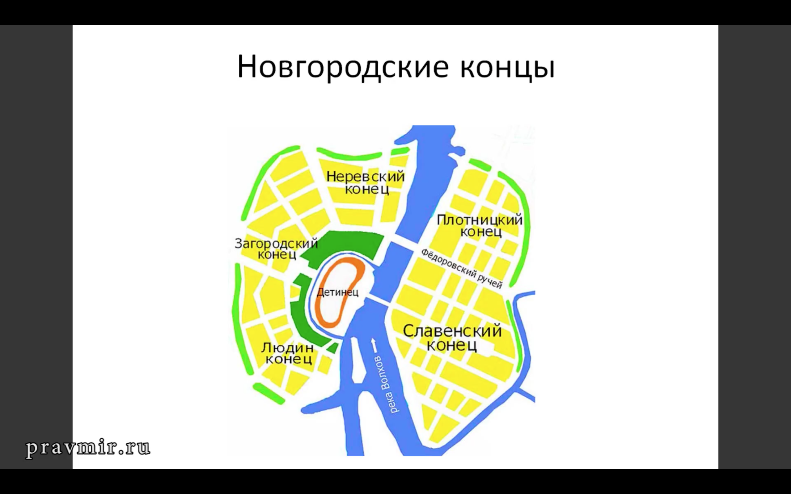

# Новгород

Земледелие было, но полностью обеспечить себя хлебом новгородцы не могли

Новогород зависел от блокады торговых путей — Владимир мог перекрыть пути. Нужны были хорошие отношения с соседями

Система проходила через Финский залив

Архиепископ играл важную политическую роль → Вот пусть он найдёт Сергея раньше, чем Илья!

Иноземные дворы — конторы купцов с Ганзы и тд.

Вече собиралось у Николо-Дворещенского собора

Из Новгорода вывозили пушнину и воск

Город выступал сюзереном по отношению к области

Деревянные настилы

**Архиепископ.** 

«Глава Новгородской епархии (епископии, к концу XII века — архиепископии), подчиняется митрополиту Киевскому, который, в свою очередь, ставится константинопольским патриархом. Архиепископ является гарантом прав и свобод граждан, участвует в обсуждении вопросов войны и мира, мирит граждан, концы и стороны между собой, часто с этой целью выходит во главе крестного хода на Великий мост, где происходят стычки, и останавливает вооруженное противостояние.»

